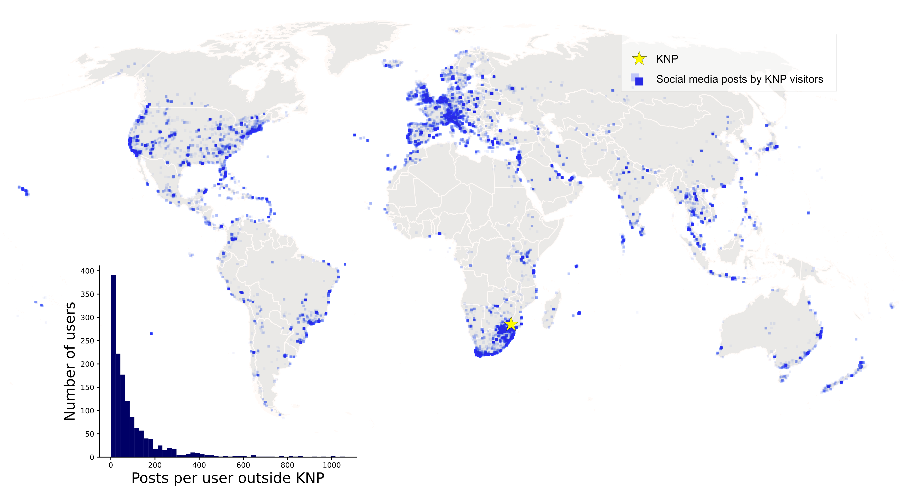

# Estimating the origins of people from social media: comparison of techniques

This repository provides supplementary information for the article *Estimating the origins of people from social media data: a critical comparison of measuring techniques*.

## Source data

- **Global posting history covering years 2010-2016 of social media users who visited Kruger National Park in 2014**
    - Based on publicly available data collected from the Instagram API in spring 2016
    - Each point has information of the related administrative areas (Contintents, subregions & countries)
    - This repository contains **de-identified and mocked demo data** in [demo_data folder](./demo_data). Geotags, timestams and userids are fake in this layer, but it allows testing the origin detection techniques. 
    

*Results in the manuscript are based on data from 1375 users (33 % sample included in the expert assessment)*

## Origin detection approaches
- BASIC (no hierarchy)
- HIERARCHICAL ( Continent --> Subregion --> Country)

|   APPROACH        |    Measuring   technique              	|    Definition of home location                                                            |   Associated Tool / Script	|
|-----------------	|---------------------------------------	|------------------------------------------------------------------------------------------	|------------------------------	|
| SIMPLE           	|    number of posts                        |    Country with most posts                                                                |  <ul><li>[BASIC](codes/maxposts_basic.py)</li><li>[HIERARCHICAL](codes/maxposts_hierarchical.py)</li></ul>|
| SPATIAL         	|    mean center                    	|    Country where average centre point is located                                                  |  Mean center in: <ul><li>[BASIC](codes/spatial_arcpy/1a_spatial_arcpy_basic.py)</li><li>[HIERARCHICAL](codes/spatial_arcpy/1b_spatial_arcpy_hierarchical.py)</li></ul>		|
| SPATIAL         	|    median center                    	|    Country where median center is located                                                  |  Median center in: <ul><li>[BASIC](codes/spatial_arcpy/1a_spatial_arcpy_basic.py)</li><li>[HIERARCHICAL](codes/spatial_arcpy/1b_spatial_arcpy_hierarchical.py)</li></ul>	|
|                 	|    center of SD ellipse               	|    Country where centre point of Standard Deviational Ellipse is located                  | Ellipse centroid in: <ul><li>[BASIC](codes/spatial_arcpy/1a_spatial_arcpy_basic.py)</li><li>[HIERARCHICAL](codes/spatial_arcpy/1b_spatial_arcpy_hierarchical.py)</li></ul>|
|                 	|    center of SD circle    	|    Country where centre point of Standard Distance Circle is located                      |Circle centroid in: <ul><li>[BASIC](codes/spatial_arcpy/1a_spatial_arcpy_basic.py)</li><li>[HIERARCHICAL](codes/spatial_arcpy/1b_spatial_arcpy_hierarchical.py)</li></ul> |
|                 	|    clustering                          	|    Country where centre point of most significant cluster is located     	                |  DBSCAN: <ul><li>[BASIC](codes/clusters_basic.py)</li><li>[HIERARCHICAL](codes/clusters_hierarchical.py)</li></ul>|
| TEMPORAL        	|    max visit length                   	|    Country which has longest stay time between last – first post date    	                |MaxTimedelta in: <ul><li>[BASIC](codes/temporal_basic.py)</li><li>[HIERARCHICAL](codes/temporal_hierarchical.py)</li></ul>	|
|                 	|    frequency by months                	|    Country with max frequency by active months. If two or more countries have equal frequency, then country with most posts is chosen                   	| MaxMonths in: <ul><li>[BASIC](codes/temporal_basic.py)</li><li>[HIERARCHICAL](codes/temporal_hierarchical.py)</li></ul> 	|
|                 	|    frequency by weeks                 	|    Country with max frequency by active weeks. If two or more countries have equal frequency, then country with most posts is chosen                     	| MaxWeeks in: <ul><li>[BASIC](codes/temporal_basic.py)</li><li>[HIERARCHICAL](codes/temporal_hierarchical.py)</li></ul>  	|
|                 	|    frequency by days                  	|    Country with max frequency by active days. If two or more countries have equal frequency, then country with most posts is chosen                       	| MaxDays in: <ul><li>[BASIC](codes/temporal_basic.py)</li><li>[HIERARCHICAL](codes/temporal_hierarchical.py) </li></ul>  	|

## Results

Jupyter notebooks for plotting the result tables and figures:
- [F1-scores](notebooks/F1-scores.ipynb)
- [expert agreement](ia_agreement.ipynb)
- [Spearmann correlation](notebooks/spearman.ipynb)
- [slopegraph](notebooks/plot_graphs.ipynb)
- [Maps](notebooks/plot_maps.ipynb)
